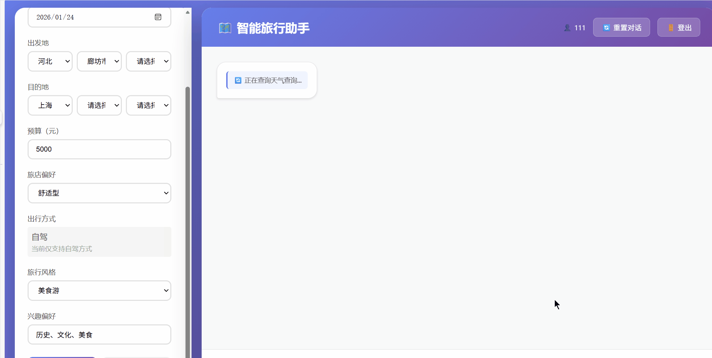
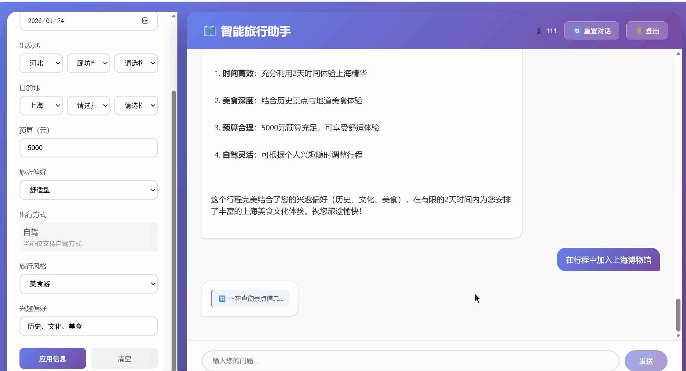

# LLM-Travel-Assistant

基于大语言模型（LLM）的智能旅行助手，采用多Agent架构设计，支持自然语言行程规划、景点问答、个性化推荐等功能。集成高德地图API提供实时天气、交通路线、酒店价格和景点信息。项目包含完整的Agent测试框架，确保系统稳定性和可靠性。

## 🎬 项目演示

### 演示1：初次查询


展示用户首次使用系统进行查询的流程，包括对话交互和实时响应。

### 演示2：修改行程


展示用户修改和完善旅行行程的过程，包括多轮对话和动态更新。

## ✨ 功能特性

### 🤖 多Agent架构
- **协调Agent**：`TravelAgent` 作为主协调者，智能路由用户请求到相应的专门Agent
- **专门Agent**：6个专门Agent各司其职
  - `WeatherAgent`：天气查询服务
  - `TransportAgent`：交通路线规划服务
  - `HotelAgent`：酒店价格查询服务
  - `AttractionAgent`：景点信息查询服务
  - `PlanningAgent`：行程规划服务
  - `RecommendationAgent`：个性化推荐服务

### 🌤️ 实时天气查询
- 使用高德地图API获取天气信息
- 支持4天天气预报和当天实况天气
- 超过4天的日期返回提示信息（不支持查询）
- 天气查询结果自动记录到终端日志，方便验证准确性
- 自动限流控制（每秒最多3次请求，最多3个并发）

### 🏨 酒店价格估算
- 智能估算酒店价格，基于城市、季节、酒店类型等因素
- 支持经济型、舒适型、豪华型、民宿、青旅等多种类型
- 考虑城市等级、旅游旺季/淡季等因素

### 🚗 交通路线规划
- **自驾**：使用高德地图API精准计算距离、时间、过路费、油费
- **公共交通**：提供飞机、高铁、火车、大巴的票价和时间估算
- **智能回答**：根据用户问题的具体程度提供相应详细程度的回答
  - 简单问题（如"需要多久？"）→ 简洁回答
  - 详细规划需求 → 完整信息（距离、时间、费用、建议等）
- 自动限流控制，避免API调用超限

### 🎫 景点门票查询
- 使用高德地图v5 POI API查询景点信息
- 支持按兴趣偏好筛选景点
- 显示景点人均消费（cost字段）和评分（rating字段）
- 提供景点门票价格参考信息

### 🗺️ 智能行程规划
- 根据目的地、天数、预算等自动生成详细行程
- 自动整合天气、酒店、交通、景点信息
- 支持流式响应，实时显示规划进度

### ❓ 景点问答
- 回答关于景点的各种问题（开放时间、门票、最佳游览时间等）
- 基于实时API数据提供准确答案

### 🎯 个性化推荐
- 根据用户兴趣和旅行风格提供定制化推荐
- 支持历史、文化、美食、自然等多种兴趣偏好

### 💬 对话记忆
- 支持多轮对话，记住上下文信息
- 每个用户独立的会话管理

### 👤 用户系统
- 支持用户注册、登录
- 每个用户独立的Agent实例和对话历史

### 🌐 Web界面
- 现代化的聊天界面
- 支持实时对话和旅行信息表单
- 支持省市区三级联动选择
- 流式响应，实时显示工具执行进度

### 🧪 测试套件
- **工具函数测试**：在`scripts/`目录下，测试各个工具函数（天气、酒店、景点、交通等）
- **Agent测试**：在`tests/`目录下，完整的Agent测试框架
  - Agent路由测试：验证主Agent正确路由到专门Agent
  - 函数调用测试：验证LLM准确选择工具和提取参数
  - 内存测试：验证Agent的对话记忆和上下文管理
  - 性能测试：测试API调用次数和响应时间
  - 集成测试：端到端完整流程测试
- **测试工具**：自定义回调处理器，非侵入式监控Agent行为

## 📁 项目结构

```
LLM-Travel-Assistant/
├── src/                          # 源代码目录
│   ├── agent/                    # Agent核心模块
│   │   ├── travel_agent.py      # 旅行助手协调Agent（多Agent架构）
│   │   ├── specialized_agents.py # 专门Agent（天气、交通、酒店、景点、规划、推荐）
│   │   └── tools.py             # Agent工具定义（天气、酒店、交通、景点）
│   ├── models/                   # 数据模型
│   │   └── user.py              # 用户模型
│   ├── utils/                    # 工具模块
│   │   ├── amap_rate_limiter.py # 高德地图API限流器
│   │   └── logger.py            # 日志记录器
│   ├── config.py                # 配置管理
│   └── main.py                  # 命令行入口
│
├── templates/                    # Web模板文件
│   ├── index.html               # 聊天界面模板（支持省市区三级联动）
│   ├── login.html               # 登录页面
│   └── register.html            # 注册页面
│
├── data/                        # 数据目录
│   └── users.json               # 用户数据（Git忽略）
│
├── demos/                       # 演示文件
│   ├── 初次查询.gif            # 演示1：初次查询演示
│   └── 修改形成.gif            # 演示2：修改行程演示
│
├── tests/                       # 测试文件
│   ├── fixtures/               # 测试工具和fixtures
│   │   └── test_callback_handler.py  # 测试用CallbackHandler
│   ├── test_agent_tools.py     # 工具函数测试（使用mock）
│   ├── test_agent_api_connection.py  # API连接和功能测试（真实API）
│   ├── test_specialized_agents.py    # 专门Agent初始化测试
│   ├── test_agent_routing.py   # Agent路由测试
│   ├── test_function_calling.py # Function Calling测试
│   ├── test_agent_memory.py    # Agent记忆机制测试
│   ├── test_agent_performance.py # Agent性能测试
│   ├── test_agent_integration.py # Agent集成测试
│   ├── test_agent_all.py       # 运行所有Agent测试
│   ├── run_all_tests.py        # 测试运行脚本
│   ├── README.md               # 测试文档
│   └── README_AGENT_TESTS.md   # Agent测试详细说明
│
├── scripts/                     # 工具脚本
│   ├── test_weather_api.py     # 天气API测试
│   ├── test_geocoding.py       # 地理编码测试
│   ├── test_driving_route.py   # 自驾路线测试
│   ├── test_hotel_prices.py    # 酒店价格测试
│   ├── test_attraction_tickets.py # 景点门票测试
│   ├── test_attraction_question.py # 景点问答测试
│   ├── test_travel_itinerary.py # 行程规划测试
│   ├── test_personalized_recommendations.py # 个性化推荐测试
│   └── test_api_connection.py  # API连接测试
│
├── docs/                        # 文档目录
│   ├── PROJECT_OVERVIEW.md     # 项目概述
│   ├── QUICK_START.md          # 快速开始指南
│   ├── RUN_GUIDE.md            # 运行指南
│   └── TROUBLESHOOTING.md      # 故障排除
│
├── app.py                       # Flask Web应用入口
├── config.yaml                  # 配置文件
├── requirements.txt            # Python依赖
├── env.example                  # 环境变量示例
├── PROJECT_STRUCTURE.md        # 项目结构说明
├── LICENSE                     # 许可证
└── README.md                   # 项目说明
```

## 🚀 快速开始

### 1. 环境要求

- Python 3.8+
- pip

### 2. 安装依赖

```bash
# 克隆项目（如果从Git仓库）
git clone <repository-url>
cd LLM-Travel-Assistant

# 创建虚拟环境（推荐）
python -m venv .venv

# 激活虚拟环境
# Windows:
.venv\Scripts\activate
# Linux/Mac:
source .venv/bin/activate

# 安装依赖
pip install -r requirements.txt
```

### 3. 配置环境变量

复制 `env.example` 为 `env` 并填入您的配置：

```bash
cp env.example env
```

编辑 `env` 文件，设置必要的API密钥：

```bash
# 必需：LLM API配置
OPENAI_API_KEY='your_openai_api_key_here'
OPENAI_API_BASE='https://api.deepseek.com/v1'  # 或使用OpenAI官方API
LLM_MODEL='deepseek-chat'  # 或 'gpt-4-turbo-preview'

# 可选：第三方API配置（不配置将使用智能估算）
# 高德地图API（同时用于天气、交通路线和景点查询）
AMAP_API_KEY='your_amap_api_key_here'
```

### 4. 运行程序

#### 方式1：Web界面（推荐）

```bash
python app.py
```

然后在浏览器中访问：`http://127.0.0.1:5000`

首次使用需要注册账号，登录后即可使用。

#### 方式2：命令行界面

```bash
python src/main.py
```

## 📖 使用指南

### Web界面使用

1. **注册/登录**
   - 首次使用需要注册账号
   - 登录后即可使用所有功能

2. **填写旅行信息**（可选）
   - 在左侧表单填写：
     - 出发日期和返回日期
     - 出发地和目的地（支持省市区三级联动）
     - 预算
     - 旅店偏好（经济型/舒适型/豪华型/民宿/青旅）
     - 出行方式（仅支持自驾）
     - 旅行风格（休闲游/深度游/探险游/文化游/美食游）
     - 兴趣偏好（如：历史、文化、美食）

3. **生成旅行计划**
   - 点击"生成旅行计划"按钮
   - 系统会自动查询天气、酒店、交通、景点信息
   - 实时显示工具执行进度
   - 生成详细的行程安排

4. **对话交互**
   - 在输入框中输入问题
   - 与助手进行多轮对话
   - 支持自然语言查询

### 命令行界面使用

```bash
python src/main.py
```

示例对话：

```
您: 帮我规划一个3天的北京行程，预算5000元

您: 北京明天天气怎么样？

您: 我喜欢历史和文化，推荐一些北京的景点
```

## ⚙️ API配置说明

### 必需配置

- **LLM API**：支持OpenAI API或兼容的API（如DeepSeek）
  - `OPENAI_API_KEY`：API密钥
  - `OPENAI_API_BASE`：API地址（默认：`https://api.openai.com/v1`）
  - `LLM_MODEL`：模型名称（默认：`gpt-4-turbo-preview`）

### 可选配置

- **高德地图API**（天气+交通+景点）
  - 注册地址：https://lbs.amap.com/
  - 免费额度：每天30万次调用（个人开发者）
  - 环境变量：`AMAP_API_KEY`
  - 功能：
    - 天气查询（4天预报+实况）
    - 自驾路线规划（精准计算距离、时间、费用）
    - 景点信息查询（POI搜索）
  - **限流控制**：自动限制每秒最多3次请求，最多3个并发

## 🔧 配置说明

主要配置在 `config.yaml` 文件中：

- **LLM配置**：模型、温度、最大token数
- **Agent配置**：最大迭代次数、是否启用记忆
- **工具配置**：行程规划、景点问答、推荐等参数

## 🧪 测试

### 运行工具测试

在 `scripts/` 目录下运行各个工具的测试脚本：

```bash
# 测试天气API
python scripts/test_weather_api.py

# 测试酒店价格
python scripts/test_hotel_prices.py

# 测试景点门票
python scripts/test_attraction_tickets.py

# 测试行程规划
python scripts/test_travel_itinerary.py
```

### 运行Agent测试

在 `tests/` 目录下运行Agent测试：

```bash
# 运行所有Agent测试
python -m unittest tests.test_agent_all

# 运行单个测试文件
python -m unittest tests.test_agent_routing

# 运行单个测试方法
python -m unittest tests.test_agent_routing.TestAgentRouting.test_weather_routing
```

### 测试说明

- **工具函数测试**（`scripts/`目录）：
  - 测试各个工具函数的基本功能
  - 使用硬编码测试用例，便于调试
  - 需要配置API密钥（高德地图API）

- **Agent测试**（`tests/`目录）：
  - **test_agent_routing.py**：验证主Agent正确路由到专门Agent
  - **test_function_calling.py**：验证LLM准确选择工具和提取参数
  - **test_agent_memory.py**：验证Agent的对话记忆和上下文管理
  - **test_agent_performance.py**：测试API调用次数和响应时间
  - **test_agent_integration.py**：端到端完整流程测试
  - **test_agent_tools.py**：工具函数测试（使用mock）
  - **test_agent_api_connection.py**：真实API连接测试

### 测试工具

- **TestCallbackHandler**：自定义回调处理器，非侵入式监控Agent行为
  - 跟踪工具调用、Agent调用、LLM调用
  - 提供调用序列和统计信息

详细测试文档请参考：
- [tests/README_AGENT_TESTS.md](tests/README_AGENT_TESTS.md) - Agent测试详细说明
- [tests/HOW_TO_RUN_SINGLE_TEST.md](tests/HOW_TO_RUN_SINGLE_TEST.md) - 如何运行单个测试方法

## 🛠️ 技术栈

- **LangChain**：Agent框架和工具链，支持多Agent架构
- **OpenAI API / DeepSeek API**：LLM服务
- **高德地图API**：
  - 天气查询（4天预报+实况）
  - 路径规划（自驾路线精准计算）
  - 景点查询（POI搜索）
- **Flask**：Web框架
- **Python 3.8+**：开发语言
- **unittest**：单元测试框架

## 📚 功能详解

### 天气查询
- 使用高德地图API获取实时天气和4天预报
- 超过4天的日期使用当前天气并给出估算提示
- 自动限流控制，避免API调用超限

### 酒店价格估算
- 基于城市、季节、酒店类型的智能估算
- 支持经济型、舒适型、豪华型、民宿、青旅等类型
- 考虑城市等级、旅游旺季/淡季等因素

### 交通路线规划
- **自驾**：使用高德地图API的地址编码和路线规划API，精准计算距离、时间、过路费、油费
- 自动限流控制，确保API调用不超过限制

### 景点门票查询
- 使用高德地图POI API获取景点信息
- 支持按兴趣偏好筛选景点
- 提供门票价格估算

### 流式响应
- 支持Server-Sent Events (SSE)流式响应
- 实时显示工具执行进度
- 提升用户体验

## 📝 开发计划

- [x] Web界面开发
- [x] 项目目录整理
- [x] 用户登录系统
- [x] 实时天气查询功能
- [x] 交通路线规划（自驾精准计算）
- [x] 景点门票查询
- [x] 酒店价格估算
- [x] 多Agent架构重构
- [x] 单元测试套件
- [x] 省市区三级联动选择
- [x] 流式响应支持
- [x] API限流控制
- [ ] 支持更多LLM提供商（Claude、Gemini等）
- [ ] 对话历史保存
- [ ] 支持多语言
- [ ] 移动端适配

## 📄 文档

- [快速开始指南](docs/QUICK_START.md)
- [运行指南](docs/RUN_GUIDE.md)
- [故障排除](docs/TROUBLESHOOTING.md)
- [项目结构说明](PROJECT_STRUCTURE.md)
- [项目概述](docs/PROJECT_OVERVIEW.md)

## 📜 许可证

MIT License

## 🤝 贡献

欢迎提交Issue和Pull Request！

## ⚠️ 注意事项

1. **API密钥安全**：请勿将包含真实API密钥的 `env` 文件提交到代码仓库
2. **用户数据**：用户数据存储在 `data/users.json`，已配置Git忽略
3. **API限制**：注意各API的调用频率限制，合理使用
4. **估算数据**：当API不可用时，系统会使用智能估算，实际价格可能有所不同
5. **限流控制**：高德地图API自动限流，每秒最多3次请求，最多3个并发

## 📅 变更日志

### 2026-01-21 - Agent优化与测试完善

#### 🎯 Agent回答优化
- ✅ **TransportAgent简洁回答**：根据用户问题的具体程度提供相应详细程度的回答
  - 简单问题（如"需要多久？"）→ 只回答时间
  - 简单问题（如"距离是多少？"）→ 只回答距离
  - 详细规划需求 → 提供完整信息
- ✅ **主Agent优化**：主协调Agent直接返回专门Agent的回答，不添加额外信息
- ✅ **天气查询日志**：天气查询结果自动记录到终端日志，方便验证准确性

#### 🧪 测试框架完善
- ✅ **Agent测试套件**：新增完整的Agent测试框架
  - Agent路由测试：验证主Agent正确路由到专门Agent
  - 函数调用测试：验证LLM准确选择工具和提取参数
  - 内存测试：验证Agent的对话记忆和上下文管理
  - 性能测试：测试API调用次数和响应时间
  - 集成测试：端到端完整流程测试
- ✅ **测试工具**：自定义回调处理器（TestCallbackHandler），非侵入式监控Agent行为
- ✅ **测试输出优化**：抑制Pydantic弃用警告，清理测试日志输出
- ✅ **测试用例优化**：测试通过时打印Agent的具体回答，方便验证准确性

#### 📊 日志系统优化
- ✅ **天气查询日志**：天气查询成功时自动记录到终端日志
- ✅ **日志格式优化**：统一的日志格式，清晰的标识和分类

### 2026-01-21 - API升级与性能优化

#### 🔄 API升级
- ✅ **高德地图v5 API**：景点查询从v3升级到v5 API (`v5/place/text`)
- ✅ **景点信息增强**：支持cost字段（人均消费）和rating字段（评分）显示
- ✅ **地理位置编码优化**：使用adcode提高搜索精度

#### ⚡ 性能优化
- ✅ **避免重复查询**：优化`plan_travel_itinerary`工具，支持`existing_*`参数复用已查询信息
- ✅ **AttractionAgent优化**：优化提示词，确保返回完整景点信息而非简短确认
- ✅ **减少API调用**：主协调Agent明确说明每个专门Agent只需调用一次

#### 📊 测试完善
- ✅ **测试脚本优化**：统一所有测试脚本风格，使用硬编码测试用例便于调试
- ✅ **天气测试完善**：支持测试今天实况天气和未来预报天气

#### 📚 文档更新
- ✅ **项目演示**：添加演示GIF文件（初次查询、修改行程）
- ✅ **README更新**：更新项目结构和演示说明

### 2025-01-15 - 代码优化与架构完善

#### 🔧 代码优化
- ✅ **工具函数优化**：移除工具层的活动建议逻辑，由Agent的LLM负责生成建议，符合职责分离原则
- ✅ **API限流优化**：完善高德地图API限流器，确保不超过每秒3次请求的限制

#### 📝 文档更新
- ✅ **README更新**：更新项目结构、功能特性、API配置说明等
- ✅ **项目整理**：整理项目目录结构，更新文档

### 2025-01-14 - 多Agent架构重构与测试完善

#### 🎯 架构重构
- ✅ **多Agent架构**：从单一Agent重构为协调Agent + 专门Agent的架构
  - 新增 `specialized_agents.py`，包含6个专门Agent
  - `TravelAgent` 重构为主协调者，根据用户意图智能路由到相应的专门Agent

#### 🚀 功能增强
- ✅ **精准距离计算**：自驾场景下使用高德地图API精准计算距离和时间
- ✅ **省市区三级联动**：出发地和目的地支持省市区三级联动选择
- ✅ **流式响应**：支持Server-Sent Events (SSE)流式响应，实时显示工具执行进度
- ✅ **API限流**：实现高德地图API并发限流器，避免API调用超限

#### 🧪 测试完善
- ✅ **单元测试套件**：新增完整的测试框架

### 2025-01-13 - API集成与功能优化

#### 🌐 第三方API集成
- ✅ **天气API**：从OpenWeatherMap切换到高德地图API，支持4天预报和当天实况
- ✅ **交通API**：集成高德地图API，支持自驾路线精准计算
- ✅ **景点API**：集成高德地图POI API

### 2025-01-12 - 前端优化

#### 🎨 界面优化
- ✅ **表单优化**：优化表单交互和验证逻辑
- ✅ **日期选择**：优化日期选择器体验

### 2025-01-11 - 项目初始化

#### 🎉 初始版本
- ✅ **基础架构**：Flask Web应用、LangChain Agent框架
- ✅ **用户系统**：用户注册、登录功能
- ✅ **基础功能**：行程规划、景点问答、个性化推荐
- ✅ **Web界面**：现代化聊天界面
